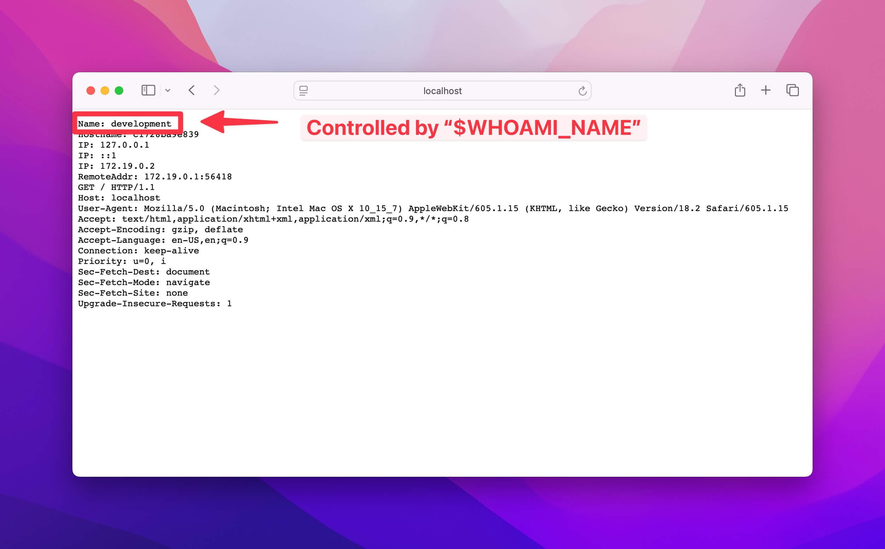

# Spin Template - Skeleton 💀
This is a skeleton template for Spin. This is an absolute barebones template to create a minimal Spin application.

## What this template does
- Gives you a fresh `.spin.yml` to work with
- Shows you a **very basic** example of how to structure your project with `docker-compose.yml`, `docker-compose.dev.yml`, and `docker-compose.prod.yml`
- Demonstrates a minimal `install.sh` script for people who create templates with Spin
- Allows the `traefik/whoami` container to be used as a simple demo service

## Traefik/Whoami
You'll notice the `template/` files are configured to run `traefik/whoami` as a service. This is a simple container that will show you the name of the service in the URL.

### Key points
- Notice how the `docker-compose.yml` file is configured to run the `traefik/whoami` container on port 80.
- In `docker-compose.dev.yml`, we've added the name of "development" to the environment variable `WHOAMI_NAME`. When you run `spin up`, you'll notice the Name will be "development".
- In `docker-compose.prod.yml`, we've added the name of "production" to the environment variable `WHOAMI_NAME`. When you run `spin up --prod`, you'll notice the Name will be "production".



# Steps to run
Use these steps to use this template:

### Install Spin
Make sure you have Spin installed: https://serversideup.net/open-source/spin/docs

### Create a project
```bash
spin new skeleton
```

### Run the project
```bash
spin up
```
